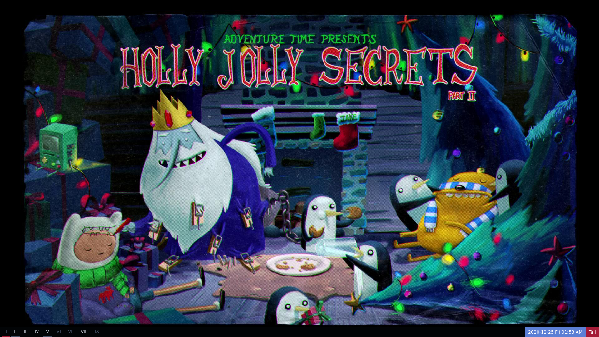
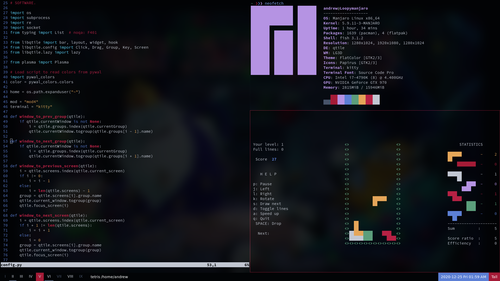

# NimbleClint's Dotfiles

## i3-Gaps and Polybar
My i3 config uses i3-Gaps, Polybar, Dunst, Rofi, and Picom. Colors are controlled using WPGTK. Because I'm making liberal use of WPGTK's templates, some of the config files have warning to avoid editing them directly and to edit the WPGTK template instead. If you aren't using WPGTK, you can safely ignore those warnings.

Power and Launcher menus are Rofi Applets (link below). Included polybar modules are KDE-Connect and Dunst.

### Screenshots

### Dependencies

Desktop Environment |
---- |
i3-Gaps |
Polybar |
Dunst |
Rofi |
[Ibhagwom's Picom](https://github.com/ibhagwan/picom) |
WPGTK |
Feh |

Command Line Interface |
---- |
Fish |
Kitty |

Polybar |
---- |
[Polybar-KDEconnect](https://github.com/haideralipunjabi/polybar-kdeconnect) (modified and included) |
[Dunst-Polybar](https://github.com/JeanEdouardKevin/dunst-polybar) (Included) |
[Popup-Calendar](https://github.com/polybar/polybar-scripts/tree/master/polybar-scripts/popup-calendar) (Included) |

Rofi Menus |
---- |
[Rofi Applets](https://github.com/adi1090x/rofi) (Some included) |

### Wallpaper
Cudos to artist: [Pixel art by AbyssWolf](https://www.deviantart.com/abysswolf/art/Finn-and-Jake-382050723)  
I don't know who made the wallpaper [but you can find it here.](https://cdn.wallpapersafari.com/88/29/AJvlRT.jpg)

## Qtile
Currently my Qtile config works pretty similarly to i3; it uses the same rofi menus but uses the qtile bar instead of polybar. It also uses WPGTK for color management.

### Screenshots

### Dependencies

Desktop Environment |
---- |
Qtile |
Dunst |
Rofi |
[Ibhagwom's Picom](https://github.com/ibhagwan/picom) |
WPGTK |
Feh |

Command Line Interface |
---- |
Fish |
Kitty |

Rofi Menus |
---- |
[Rofi Applets](https://github.com/adi1090x/rofi) (Some included) |
