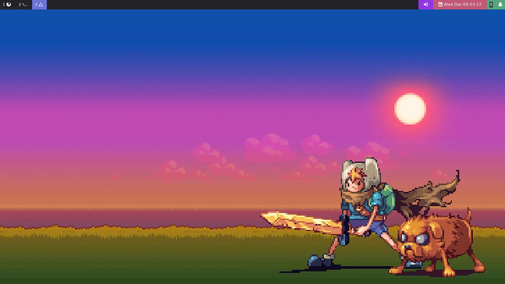
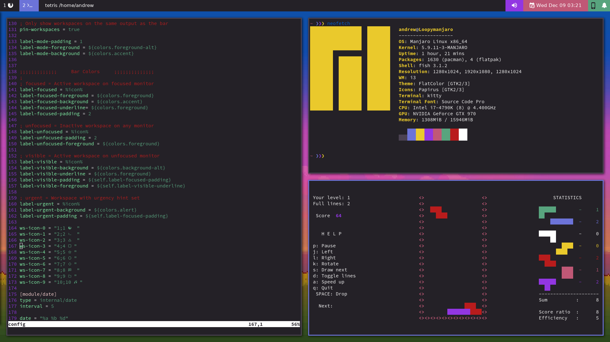

# NimbleClint's Dotfiles
## Qtile

### Installation Notes
These dotfiles are set up to use GNU stow for installation. To install, first **MAKE SURE YOUR EXISTING CONFIG FILES ARE BACKED UP.** Once you have done that, make sure GNU Stow is installed on your system, then:
- Clone this repo somewhere on your drive
- cd into the cloned repo
- Enter the command (leave out folders you don't want):

~~~~
stow dunst picom qtile rofi
~~~~

Colors are controlled by WPGTK, which uses pywal. When running, Qtile wants to find the following file:

~~~~
~/.cache/wal/colors.json
~~~~

If you don't have this, you can generate it by running either pywal or WPGTK for the first time.  

Many of my config files are controlled using WPGTK templates. I have put warnings on many of these files to warn against editing files directly - they should be modified by editing the WPGTK template. If you are not using WPGTK, you can ignore these warnings. If you are using WPGTK, set up templates for the following files:

~~~~
rofi/rofi-center.rasi
rofi/rofi-dmenu.rasi
rofi/applets/styles/wpgtk.rasi
dunst/dunstrc
~~~~

### Apps Used
Desktop Environment |
---- |
Qtile |
Dunst |
Rofi |
[Ibhagwom's Picom](https://github.com/ibhagwan/picom) |
WPGTK |
Feh |

Command Line Interface |
---- |
Fish |
Kitty |

Rofi Menus (Included)|
---- |
[Rofi Applets - Power Menu](https://github.com/adi1090x/rofi) |
[DT's Rasi files](https://gitlab.com/dwt1/dotfiles/-/tree/master/.config/rofi/themes) |

Fonts |
---- |
DejaVu Sans |
Iosevka Nerd Font |
Terminal Font: Source Code Pro |

## i3-Gaps and Polybar

### Installation Notes
My i3 config is not used or updated anymore these days. The following files have i3 specific versions. To set them up, simply remove the ".i3wm" from the file name (backup the old config file first):

~~~~
.config/rofi/applets/menu/powermenu.sh.i3wm
.config/dunst/dunstrc.i3wm
~~~~

### Apps Used
Desktop Environment |
---- |
i3-Gaps |
Polybar |
Dunst |
Rofi |
[Ibhagwom's Picom](https://github.com/ibhagwan/picom) |
WPGTK |
Feh |

Command Line Interface |
---- |
Fish |
Kitty |

Polybar |
---- |
[Polybar-KDEconnect](https://github.com/haideralipunjabi/polybar-kdeconnect) (modified and included) |
[Dunst-Polybar](https://github.com/JeanEdouardKevin/dunst-polybar) (Included) |
[Popup-Calendar](https://github.com/polybar/polybar-scripts/tree/master/polybar-scripts/popup-calendar) (Included) |

Rofi Menus (NOT included) |
---- |
[Rofi Applets](https://github.com/adi1090x/rofi) |

Fonts |
---- |
Any Nerd Font
Font Awesome 5
DejaVu Sans/DejaVu Sans mono
Terminal font: Source Code Pro

### Wallpaper
Cudos to artist: [Pixel art by AbyssWolf](https://www.deviantart.com/abysswolf/art/Finn-and-Jake-382050723)  
I don't know who made the wallpaper [but you can find it here.](https://cdn.wallpapersafari.com/88/29/AJvlRT.jpg)

